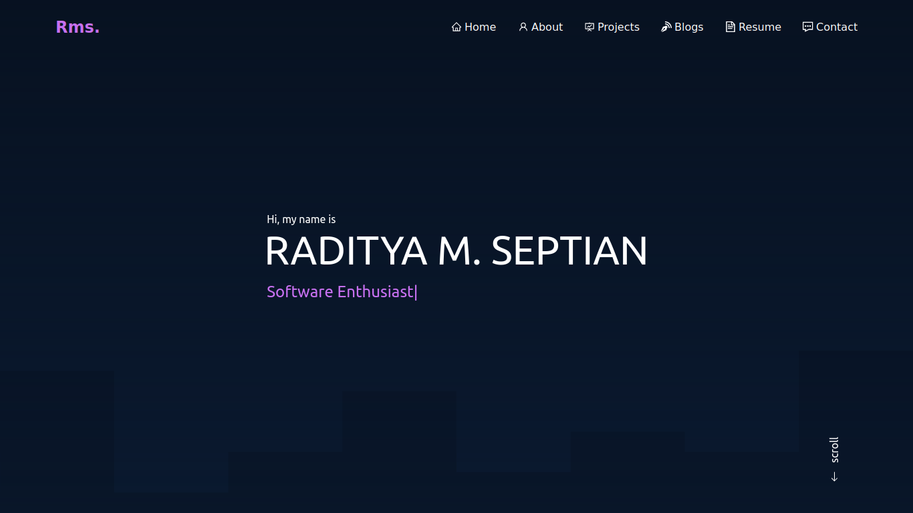

<!-- PROJECT LOGO -->
<div align="center">
  <h1 align="center">My Personal Protofolio</h1>
  <p align="center">
    An awesome Portofolio website!
    <br />
    <a href="https://radityaseptian.my.id/"><strong>View Demo »</strong></a>
  </p>
</div>



### Built With

This website using tech stack:

- React.js

- Tailwind Css

- Vite

- Vercel

<!-- GETTING STARTED -->

## Getting Started

Change what was mine into your project.

### Prerequisites

This is an example of how to list things you need to use the software and how to install them.

- node js

- git

- npm

### Installation

1. Clone the repo
   ```sh
   git clone https://github.com/radityaseptian/portofolio.git
   ```
2. Install NPM packages
   ```sh
   npm install
   ```
3. Running the program
   ```js
   npm run dev
   ```
3. See running programs
   ```js
   http://localhost:5173
   ```

<!-- CONTACT -->

## Contact

Email: radityaseptian1551@gmail.com

Project Link: [https://github.com/radityaseptian/portofolio](https://github.com/radityaseptian/portofolio)
